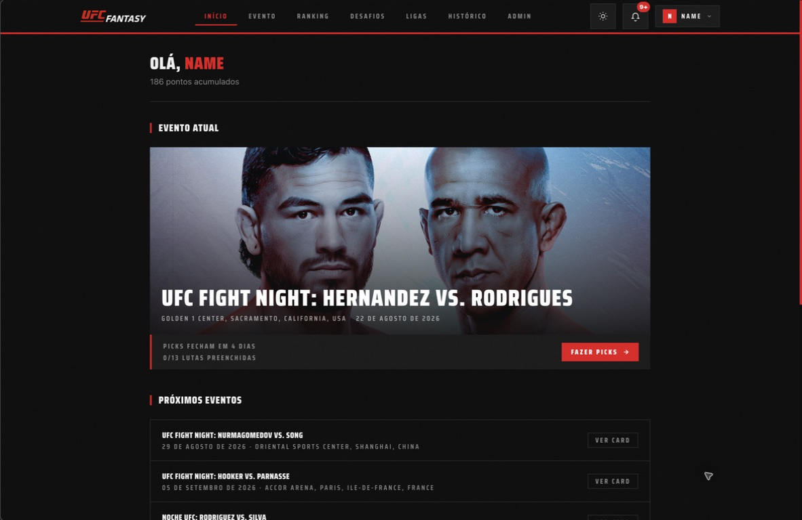
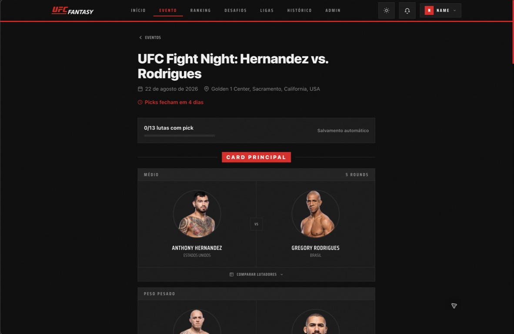
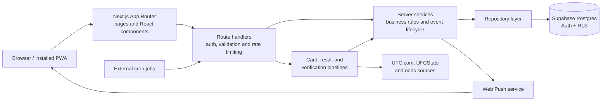

<div align="center">
  <picture>
    <source media="(prefers-color-scheme: dark)" srcset="./public/logo-dark.svg">
    <source media="(prefers-color-scheme: light)" srcset="./public/logo-light.svg">
    
  </picture>

  <p><strong>A full-stack UFC pick'em experience for competing with friends on every fight night.</strong></p>

  <p>
    <a href="https://ufc-fantasy.vercel.app/"><strong>Try the live app</strong></a>
    ·
    <a href="#getting-started">Run locally</a>
    ·
    <a href="#architecture">Architecture</a>
  </p>

  <p>
    
    
    
    
    
    
  </p>
</div>



## About the project

UFC Fantasy is a production-deployed web app and Progressive Web App (PWA) where fans predict fight winners, methods, and rounds, then compete through global rankings, private leagues, and head-to-head challenges.

The application covers the full event lifecycle: discovering upcoming cards, collecting picks, locking them before the event, following fight-night activity, synchronizing official results, scoring players, and publishing recaps.

The live app is available at **[ufc-fantasy.vercel.app](https://ufc-fantasy.vercel.app/)**. Create an account to start making picks—no demo credentials are required.

> **Disclaimer:** This is an independent, unofficial fan project. It is not affiliated with, endorsed by, or sponsored by UFC.

## Features

- Picks for winner, method, and round, with automatic saving and event-aware lock times
- Global, event, and season leaderboards with rank movement
- Private leagues with invite links, standings, champions, and group chat
- Head-to-head player challenges and rivalries
- Live fight-night feed, scoring, and fighter comparison
- Public profiles, experience levels, badges, and trophy cases
- Shareable pick, result, and event recap pages
- In-app and Web Push notifications with per-user preferences
- Installable PWA with offline fallback and light/dark themes
- Admin console for events, cards, fighters, odds, results, users, badges, audits, and analytics
- Automated card discovery, verification, result synchronization, scoring, and event lifecycle jobs

## Screenshots



<p align="center"><strong>Fight card and pick interface</strong></p>

## Architecture



The application is organized as a layered modular monolith. Next.js serves the UI and HTTP endpoints, while server-side services own the business rules and repositories isolate data access. Supabase provides authentication, PostgreSQL, and Row Level Security (RLS).

## Key engineering decisions

### One deployable application

The frontend and backend use the Next.js App Router in the same codebase. This keeps deployment and local development simple while still maintaining boundaries between route handlers, services, repositories, validators, and shared types.

### Authorization at more than one layer

Protected operations combine session checks, role and banned-user guards, server-only service-role access, and database RLS policies. Public clients never receive the Supabase service-role key.

### Transactional result processing

Fight results affect picks, scores, rankings, badges, notifications, and event status. Result synchronization is therefore designed around validated inputs, audit records, idempotent operations, and transactional database functions instead of independent best-effort writes.

### Defensive external-data synchronization

Fight cards and results can change and external sources can disagree. The synchronization pipeline normalizes fighter names, restricts accepted source hosts, compares sources, records verification runs, and requires confirmation before sensitive state transitions.

### Time-driven event lifecycle

Pick locks and event states are derived from scheduled fight times rather than manual toggles alone. External cron jobs keep cards, notifications, live states, results, and completion checks moving without requiring an always-running application server.

### Progressive Web App and push delivery

The app uses a web manifest, service worker, install flow, offline fallback, VAPID-based Web Push, and user-level notification preferences to make the browser experience feel closer to a native fight-night companion.

### Automated quality gates

Unit tests cover domain logic and server boundaries, Playwright provides browser smoke coverage, and GitHub Actions runs linting, TypeScript checks, tests, production builds, and E2E validation on pull requests and pushes to `main`.

## Tech stack

| Area | Technology |
| --- | --- |
| Framework | Next.js 16, React 19, TypeScript |
| Styling and UI | Tailwind CSS, Radix UI, Motion |
| Data and authentication | Supabase Auth, PostgreSQL, Row Level Security |
| Validation and state | Zod, Zustand |
| Notifications | Web Push with VAPID |
| Testing | Vitest, Playwright, Storybook accessibility tooling |
| Delivery | Vercel, GitHub Actions, external cron jobs |

## Project structure

```text
src/
├── app/                 # Pages, layouts and HTTP route handlers
├── components/          # Feature and shared React components
├── lib/                 # Integrations, synchronization and utilities
├── server/
│   ├── auth/            # Server-side authorization guards
│   ├── repositories/    # Database access
│   ├── services/        # Application and domain workflows
│   └── validators/      # Request validation schemas
├── stores/              # Shared client-side state
└── types/               # Application and database types

supabase/
├── migrations/          # Incremental database changes
└── schema.sql            # Current schema reference

tests/
├── unit/                 # Domain and server tests
└── e2e/                  # Playwright browser smoke tests
```

## Getting started

### Prerequisites

- Node.js 22+
- npm
- A Supabase project

### Installation

```bash
git clone https://github.com/bynaassom/ufc-fantasy.git
cd ufc-fantasy
npm install
cp .env.example .env.local
```

Fill in the required values in `.env.local`:

```env
NEXT_PUBLIC_SUPABASE_URL=
NEXT_PUBLIC_SUPABASE_ANON_KEY=
SUPABASE_SERVICE_ROLE_KEY=
NEXT_PUBLIC_APP_URL=http://localhost:3000

SYNC_SECRET=
NOTIFICATIONS_CRON_SECRET=

NEXT_PUBLIC_VAPID_PUBLIC_KEY=
VAPID_PRIVATE_KEY=
VAPID_SUBJECT=mailto:you@example.com
```

Apply the schema and pending migrations to your Supabase project, then start the development server:

```bash
npm run dev
```

Open [http://localhost:3000](http://localhost:3000). Detailed environment and infrastructure notes are available in [`CONFIG.md`](./CONFIG.md).

## Database and background jobs

For a new Supabase project, use `schema.sql` as the historical base and apply any migrations in `supabase/migrations/` that are not yet represented in the database. Existing environments should apply only pending migrations in timestamp order.

The production lifecycle is driven by authenticated `POST` jobs:

| Job | Endpoint | Suggested schedule | Responsibility |
| --- | --- | --- | --- |
| Event sync | `/api/cron/sync-events` | Daily | Discover events, derive pick locks, and synchronize cards |
| Result sync | `/api/sync-results` | Every 10 minutes during events | Collect results, reach consensus, and score picks transactionally |
| Notifications and lifecycle | `/api/cron/notifications` | Every 5 minutes | Send notifications and advance event states |
| Card verification | `/api/cron/card-verification` | Hourly | Compare cards at key checkpoints and record alerts |

Fight odds are synchronized from UFC.com using each official `FightId`; no third-party odds API key is required.

Cron endpoints require their corresponding bearer secret. Never expose `SUPABASE_SERVICE_ROLE_KEY`, private VAPID keys, or cron secrets in client-side code or source control.

## Testing and quality checks

```bash
npm run lint
npx tsc --noEmit
npm test
npm run test:e2e
npm run build
```

The same checks run in CI through [`.github/workflows/ci.yml`](./.github/workflows/ci.yml).

## What I learned

<!--
This section is intentionally left for the project author.

Write this in your own voice. Useful prompts:
- What did you understand about frontend, backend, databases, and deployment?
- Which bug or architectural decision taught you the most?
- What did you build manually, and where did tools or AI assist you?
- What would you design differently if you started again?
- Which part can you now explain or implement without assistance?
-->

> **Author's note — replace this block:** Describe what you learned while turning an idea into a deployed full-stack product. Focus on specific decisions, mistakes, debugging moments, and concepts you can now explain—not only the list of technologies used.

## Development process and project ownership

This repository includes work across product design, interface implementation, backend APIs, database modeling and migrations, security rules, external integrations, automated tests, CI, and deployment.

<!--
Personalize this section before using the repository as a portfolio piece. Explain:
1. Which parts you designed and implemented.
2. Which references, libraries, tutorials, collaborators, or AI tools you used.
3. How you reviewed, tested, and validated assisted code.
4. What you are currently improving or studying.
-->

> **Author's note — replace this block:** Add a concise and transparent account of how the project was built and what you personally owned. Being able to explain the trade-offs and modify the implementation is more valuable than presenting the project as unaided work.

## License

Released under the [MIT License](./LICENSE).
